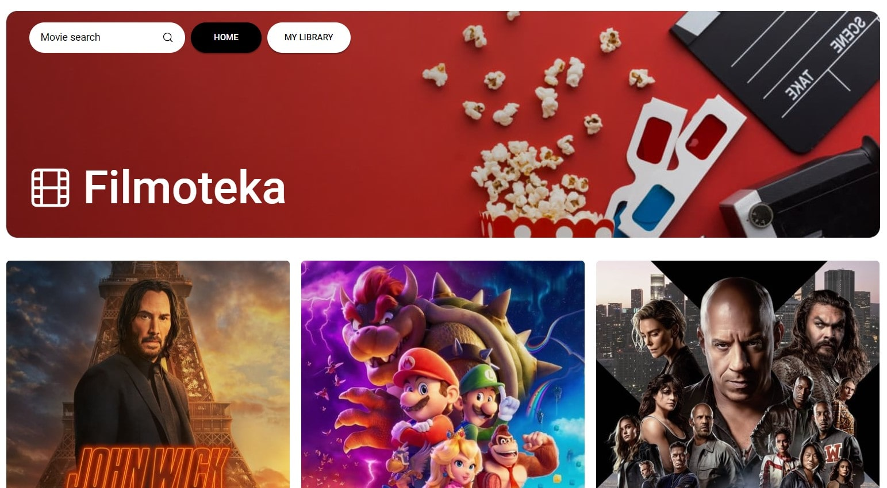
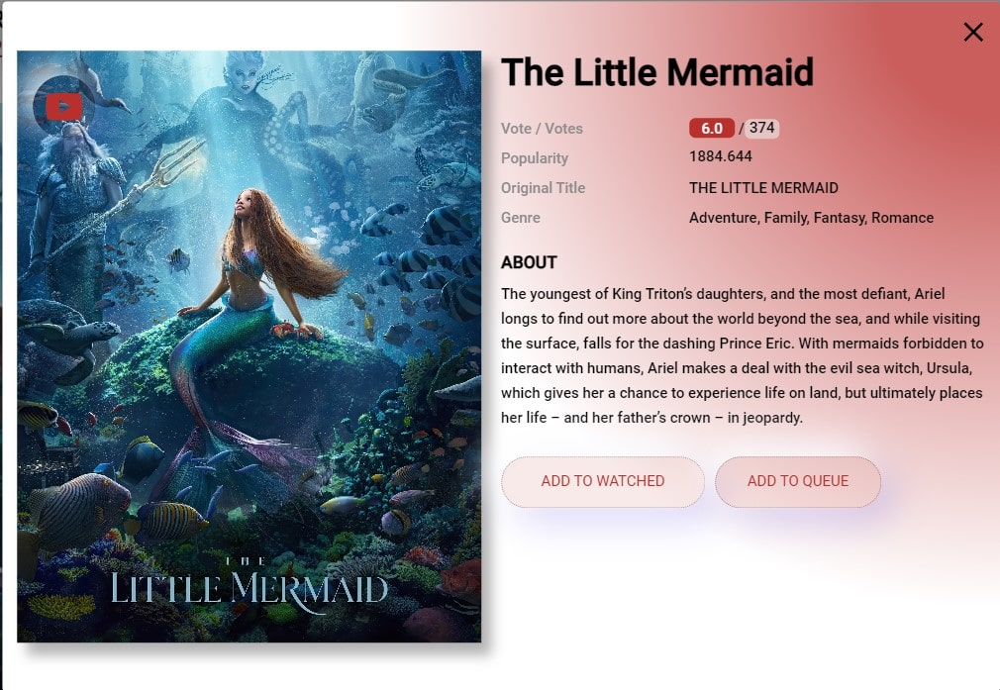
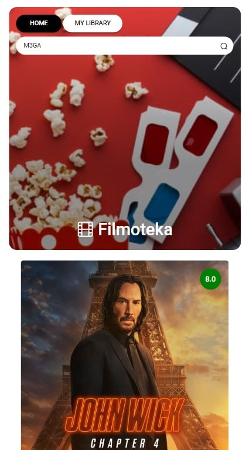

# COMMAND PROJECT FILMOTEKA

 Основною метою проекту було створити зручний та ззовні приємний сайт, де можна було б обрати фільм для усамітненого перегляду, у компанії друзів або разом зі своєю коханою людиною. Ми хотіли, щоб наш сайт був інтуїтивно зрозумілим будь-якому користувачу і ні у кого не виникало питань як ним користуватися. Користувачу наданий топ рекомендованих фільмів з можливістю ознайомитися зі змістом і базуючись на цьому обрати те, що йому до вподоби. 
 

Термін виконання: 8 днів 19 годин 

## Наша команда

Team Lead: Нікіта Лань 
Scrum-Master: Євгенія Мельниченко
Project Mentor: Наталія Валко
Розробники:
- Афанасьєв Олександр
- Констянтин Кошик 
- Іщенко Юлія 
- Багрій Ольга 
- Настенко Анна 
- Царюк Ірина 
- Лещенко Олексій 
- Царапов Захар 
- Осіпов Артем

## ОСНОВНИЙ ФУНКЦІОНАЛ САЙТУ

- Приємний оку дизайн. 
- Можливість переглянути трейлер фільму за обраною карткою безпосередньо на сайті. 
- Можливість додати фільм в особистий список переглянутого або у черзі. 
- Сайт адаптований під будь-який девайс.
- Реалізований пошук за назвою фільму.

## Сюрприз

Також на сайті схований приємний сюрприз (пасхалка). Спробуйте його знайти. 

Підказка: хтось з участників команди сховав цей сюрприз. Знайдіть його/її ім'я та прізвище ;)